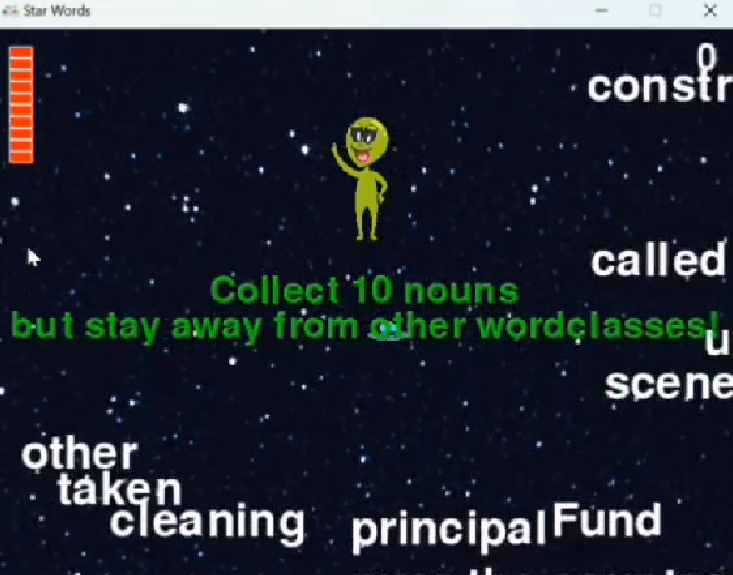
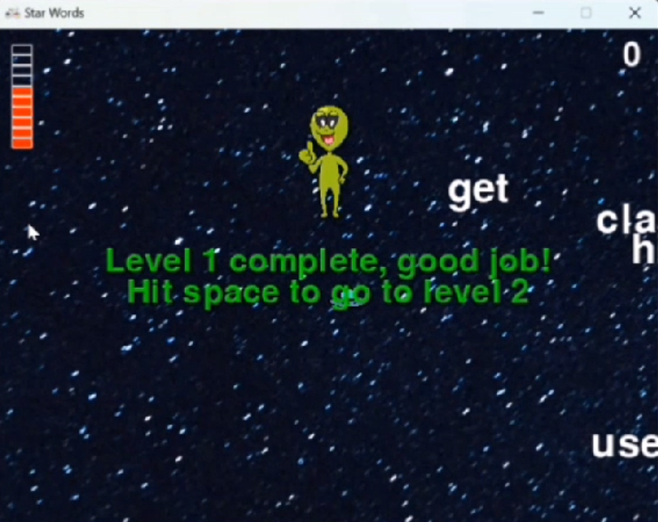

# star-words-game

**star-words** is an educational arcade game built with Python and Pygame where players pilot a UFO through space, collecting words that match a target grammatical class while avoiding incorrect ones. The game uses real vocabulary from the NLTK Brown Corpus to reinforce parts of speech through fast-paced gameplay.

*Developed as a university class project.*

---

## Screenshots


*Collect 10 nouns - but stay away from other word classes!*


*Level complete - press Space to advance!*

---

## Demo

[![Watch the demo]
https://drive.google.com/file/d/1GUrS3eoqiYKC8oNiY09yZbpeBXGMwGdr/preview

---

##  How to Play

- Move the UFO using **Arrow keys**
- **Collect** words that match the target word class for the current level
- **Avoid** words from other classes; each wrong word costs a life
- Collect **10 correct words** to complete the level
- Press **Space** to advance to the next level
- Press **Escape** to quit

---

##  Levels

| Level | Collect | Avoid |
--------------------------------
| 1 | Nouns | Verbs, Adjectives |
| 2 | Verbs | Nouns, Adjectives |
| 3 | Adjectives | Nouns, Verbs |

Words are sourced from the **NLTK Brown Corpus** — real English words tagged by grammatical class.

---

##  Lives System

- Player starts with **10 lives** (shown as a red bar on the left)
- Collecting a wrong word removes one life
- A **2-second invulnerability window** activates after each hit
- Lose all lives → **Game Over**

---

##  Installation

```bash
pip install pygame nltk
```

Then download the NLTK Brown Corpus (first run only):

```python
import nltk
nltk.download('brown')
nltk.download('universal_tagset')
```

---

##  Run the Game

```bash
python starwords.py
```

> Make sure these image files are in the same folder as the script:
> `START_UP_ALIEN.png`, `THUMBS_UP_ALIEN.png`, `ufo.png`, `gameicon.png`, `space-png2.png`

---

##  Project Structure

```
star-words/
├── starwords.py          ← Main game file
├── START_UP_ALIEN.png    ← Intro alien sprite
├── THUMBS_UP_ALIEN.png   ← Win screen alien sprite
├── ufo.png               ← Player sprite
├── gameicon.png          ← Window icon
├── space-png2.png        ← Background image
└── media/
    └── screenshots/
        ├── gameplay.png
        └── level_complete.png
```

---

##  Team

| [Romaisaa Ahmed] | Developer |
| [Stian Rydland Sivertsgård] | Developer |

---

## Asset Credits

- Alien sprites — [charatoon.com](https://charatoon.com/?id=2409) / [charatoon.com](https://charatoon.com/?id=2407)
- Space background — [freepik.com](https://www.freepik.com/free-photo/beautiful-shining-stars-night-sky_7631083.htm)
- UFO image — Google Images
- Font — `freesansbold.ttf` (bundled with Pygame)
